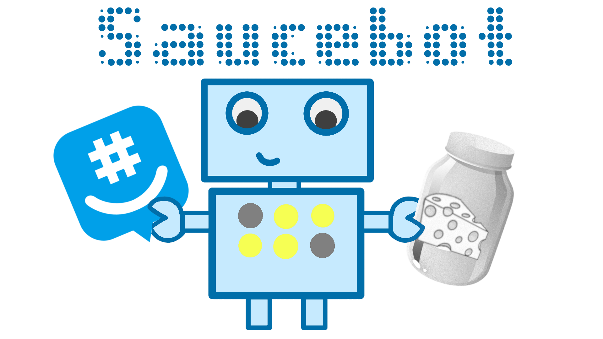

# Sauce Bot

#### Description
This program is intended to scrape the UCLA Dining Halls menu daily and determine if selected food items are available in the dining halls. Users can add or remove food items.
#### User Commands
The bot is activated by messaging "!sauce bot \[command\]". Some example commands are given below
- **info** lists a brief description of what saucebot can do
- **list** returns a list of all food items that are being tracked
- **today** gives all of the items in their respective dining halls that are available today
- **add \[food item\]** or **track \[food item\]** adds a new item to be tracked. If the item hasn't been seen before, it cannot be added. If an item doesn't exactly match with found items, suggestions will be provided
- **remove \[food item\]** takes an item off the list to be checked

#### Instructions
In order to run the program, you first need to [create a GroupMe bot](https://dev.groupme.com/tutorials/bots). Then, simply create a file called `bot_list.json` and place the following into it
```json
{
    "group_me id":"YOUR BOT ID GOES HERE"
}
```
Now to run the bot on a server, you can just run the command using nohup, eg
```python
nohup python3 flask_server.py &
```

In order to get the daily updates, the main method of sauce_boy.py needs to be run on a daily scheduler like crontab, which can be accessed by `crontab -e`. Then add a line like `* 14 * * * cd ~/sauce; sudo python3 sauce_boy.py` to run daily at 14:00 UTC (7 am Pacific Time). 

#### Contributing
If you want to contribute to Sauce Bot, you can check out some of the projects to do, or just submit your own code. Also, please report any issues you experience on the GitHub issues tab